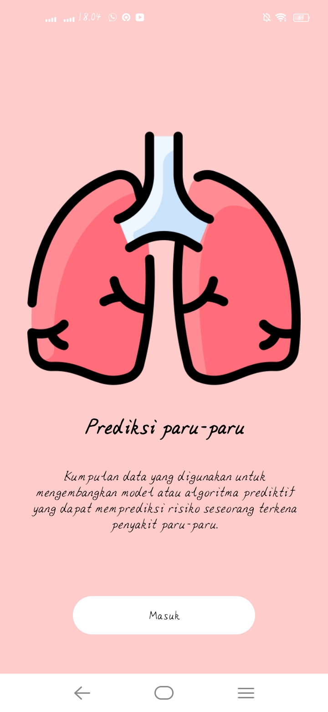

# Laporan Final Project Machine Learning

### Nama : Putri Carellilas Fony

### Nim : 211351113

### Kelas : TIF Pagi A

## Domain Proyek

Penyakit paru-paru adalah salah satu penyebab kematian tertinggi di dunia. Penyakit ini dapat disebabkan oleh berbagai faktor, termasuk Usia, Jenis_Kelamin, Merokok, Bekerja, Rumah_Tangga, Aktivitas_Begadang, Aktivitas_Olahraga, Asuransi,dan Penyakit_Bawaan

## Business Understanding

Bisa mempredic terkena penyakit paru-paru atau tidak tanpa harus melibatkan prosedur yang rumit dan peralatan mahal. 

### Problem Statements

Dalam kasus ini, masalah yang saya jelajahi adalah masalah diagnosa penyakit paru-paru saat ini melibatkan pemeriksaan fisik, tes darah, dan tes pencitraan yang memakan waktu dan biaya tinggi. Tantangan ini menyebabkan kesulitan akses dan keterbatasan bagi individu untuk mendapatkan pemeriksaan secara rutin.

### Goals

Tujuan dari proyek ini untuk memberikan aksesibilitas lebih luas terhadap prediksi risiko penyakit paru-paru.untuk dapat diakses dengan mudah oleh individu dan membantu dalam deteksi dini penyakit paru-paru.

### Solution statements

Pengembangan Aplikasi Prediksi terkena penyakit paru-paru: untuk mengatasi permasalahan prediksi terkena penyakit paru-paru.Aplikasi ini akan memanfaatkan data terkait faktor-faktor risiko yang dapat diukur untuk memberikan prediksi risiko seseorang terkena penyakit paru-paru. Dengan demikian, diharapkan aplikasi ini dapat membantu dalam deteksi dini penyakit paru-paru.

## Data Understanding

Aktivitas merokok menjadi salah satu penyebab sumber penyakit, tidak hanya berdampak pada perokok aktif saja namun orang-orang di sekitar perokok atau perokok pasif pun turut terkena dampaknya. Perokok pasif lebih mungkin mengalami dampak penyakit seperti halnya perokok aktif. Namun jika 1% populasi manusia yang ada menjadi perokok pasif maka jumlah
dokter spesialis paru yang ada tidak akan mampu menanganinya. Ini merupakan permasalahan yang harus diatasi. Pengguna dapat melakukan diagnosis awal terhadap gejala yang diderita serta pengobatannya melalui Sistem Pakar. Pada penelitian ini sistem pakar menggunakan metode kepastian faktor yang dapat memberikan kepastian suatu fakta. Perhitungan dilakukan berdasarkan nilai keyakinan seorang ahli terhadap gejala suatu penyakit. Sistem pakar yang dihasilkan diberi nama Diagperosif dimana sistem mendiagnosis penyakit berdasarkan gejala yang dimasukkan oleh pengguna. Penyakit yang dapat didiagnosis dengan Diagperosif adalah asma, bronkitis, polisi, dan kanker paru-paru.
 [Prediksi Terkena Penyakit Paru-paru] (https://www.kaggle.com/datasets/andot03bsrc/dataset-predic-terkena-penyakit-paruparu/data). 

### Variabel-variabel PREDIC TERKENA PENYAKIT PARU-PARU adalah sebagai berikut:
| No | Nama Variable    | Keterangan |Type Data|
|----|------------------|-----------|------------|
|1| No | (1-30rb)|(int64)|
|2| Usia |  Dibagi menjadi 2 yaitu muda dan tua (Muda,dari 30rb data mendapatkan 51% atau 15383) (Tua,dari 30rb data mendapatkan 49% atau 14617) |(object)
|3| Jenis_Kelamin | Dibagi menjadi 2 yaitu Wanita dan Pria (Wanita,dari 30rb data mendapatkan 74% atau 22225) (Pria,dari 30rb data mendapatkan 26% atau 7775) |(object)
|4| Merokok | Dibagi menjadi 2 yaitu Aktif dan Pasif (Aktif,dari 30rb data mendapatkan 51% atau 15210) ( Pasif,dari 30rb data mendapatkan 49% atau 14790)| (object)
|5| Bekerja | Dibagi menjadi 2 yaitu Ya dan Tidak (Ya,dari 30rb data mendapatkan 63% atau 18964) (Tidakdari 30rb data mendapatkan 37% atau 11036) |(object)
|6| Rumah_Tangga | Dibagi menjadi 2 yaitu Ya dan Tidak (Ya,dari 30rb data mendapatkan 51% atau 15425 ) (Tidak,dari 30rb data mendapatkan  49% atau 14575)| (object)
|7| Aktivitas_Begadang | Dibagi menjadi 2 yaitu Ya dan Tidak (Ya,dari 30rb data mendapatkan 58% atau 17548) (Tidak,dari 30rb data mendapatkan 42% atau 12452)| (object)
|8| Aktivitas_Olahraga | Dibagi menjadi 2 yaitu Jarang dan Sering (Jarang,dari 30rb data mendapatkan 60% atau 17994) (Sering,dari 30rb data mendapatkan 40% atau 12006)| (object)
|9| Asuransi | Dibagi menjadi 2 yaitu Ada dan Tidak (Ada,dari 30rb data mendapatkan 71% atau 21239) (Tidak,dari 30rb data mendapatkan 29% atau 8761)| (object)
|10| Penyakit_Bawaan | Dibagi menjadi 2 yaitu Ada dan Tidak (Ada,dari 30rb data mendapatkan 65% atau 19350) (Tidak,dari 30rb data mendapatkan 36% atau 10650)| (object)
|11| Hasil | Dibagi menjadi 2 yaitu Tidak Dan Ya (Tidak,dari 30rb data mendapatkan 52% atau 15648) (Ya,dari 30rb data mendapatkan 48% atau 14352)|  (object)

## Deployment

